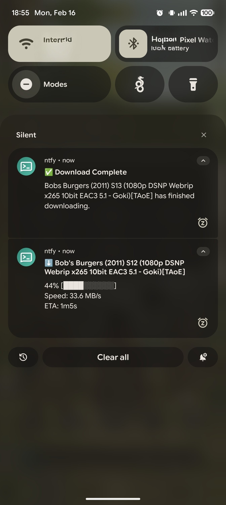
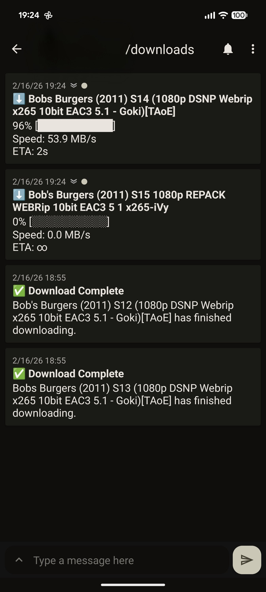

# qBit-Ntfy Sidecar

[](https://github.com/hononeko/qbit-ntfy-sidecar/releases)
[](https://github.com/hononeko/qbit-ntfy-sidecar/actions/workflows/main.yml)
[](https://github.com/hononeko/qbit-ntfy-sidecar/pkgs/container/qbit-ntfy-sidecar)

A lightweight Go sidecar for Kubernetes to monitor qBittorrent downloads and send real-time progress updates to [ntfy.sh](https://ntfy.sh) or a self-hosted ntfy server.

## Features

- **Live Grouped Notifications**: Aggregates all active downloads into a single, updating live notification card (iOS/APNs friendly to avoid push rate limits).
- **Event-Driven**: Only runs when triggered by qBittorrent (zero idle CPU usage).
- **Startup Sync**: Automatically resumes monitoring active downloads on container restart.
- **Smart Rate-Limiting**: Configurable progress step thresholds and minimum update intervals.
- **Real-time Progress**: Sends updates with ASCII progress bars or percentages.
- **Completion Alerts**: Configurable priority notification when a download finishes.
- **Flexible Auth**: Supports both authenticated and localhost-bypass access to qBittorrent.

## Notification Modes

The sidecar supports three notification modes configured via `NOTIFICATION_MODE`:

1. **`grouped` (Default & Recommended)**:
   - Aggregates all concurrent downloads into a single live notification card updated in-place every `GROUP_UPDATE_INTERVAL` (default: 15s).
   - Designed specifically for **iOS (iPhone) clients** receiving notifications via Apple Push Notification service (APNs) where high-frequency pushes quickly hit daily server limits.
   - When downloads finish, each completed torrent sends an auditable completion alert (if `NOTIFY_COMPLETE=true`), and the live card automatically updates when all downloads complete.
2. **`individual`**:
   - Sends a dedicated updating notification per torrent.
   - Uses `PROGRESS_STEP` (default: `25%`) and `MIN_UPDATE_INTERVAL` (default: `60s`) to prevent push floods.
3. **`completion_only`**:
   - Completely disables in-progress updates and only notifies when downloads finish.

## ⚠️ Security Warning

**The sidecar defaults to denying all requests to `/track`.**
You **must** configure the `ALLOWED_SUBNETS` environment variable (e.g., `ALLOWED_SUBNETS=10.0.0.0/8,192.168.1.0/24`) to allow qBittorrent to trigger notifications.

The `/track` endpoint does not implement authentication. If exposed to the internet or untrusted users on a LAN without proper IP filtering, a malicious actor could abuse the endpoint by spamming it with requests containing random torrent hashes. This would cause the sidecar to spawn excessive background processes and flood your qBittorrent instance with API and login requests, leading to a Denial of Service (DoS) via resource exhaustion. Access to the sidecar should be strictly limited to the local container network and authorized subnets.

## Installation

### Option A: Kubernetes (Recommended)

Add the sidecar container to your qBittorrent Deployment.

```yaml
containers:
  - name: qbittorrent
    image: lscr.io/linuxserver/qbittorrent:latest
    # ... your existing qbit config ...

  - name: ntfy-sidecar
    image: ghcr.io/hononeko/qbit-ntfy-sidecar:latest
    imagePullPolicy: Always
    resources:
      requests:
        cpu: "10m"
        memory: "32Mi"
      limits:
        cpu: "100m"
        memory: "128Mi"
    env:
      - name: ALLOWED_SUBNETS
        value: "10.0.0.0/8" # Pod network subnet
      - name: QBIT_HOST
        value: "http://localhost:8080"
      - name: NTFY_TOPIC
        value: "my_downloads"
      - name: NTFY_SERVER
        value: "https://ntfy.sh"
      - name: PROGRESS_FORMAT
        value: "bar" # or "percent"
      # Optional: If you need Ntfy Auth
      # - name: NTFY_USER
      #   valueFrom: { secretKeyRef: { name: ntfy-secrets, key: username } }
      # - name: NTFY_PASS
      #   valueFrom: { secretKeyRef: { name: ntfy-secrets, key: password } }
```

### Option B: Docker Compose

There are two common ways to run the sidecar with Docker Compose.

**Method 1: Sidecar joins qBittorrent's network (Recommended)**
This allows the sidecar to access qBittorrent via `localhost`, which simplifies authentication (if "Bypass authentication for clients on localhost" is enabled in qBit).

```yaml
services:
  qbittorrent:
    image: lscr.io/linuxserver/qbittorrent:latest
    container_name: qbittorrent
    # ... your other qbit config

  sidecar:
    image: ghcr.io/hononeko/qbit-ntfy-sidecar:latest
    container_name: qbit-ntfy-sidecar
    network_mode: service:qbittorrent # Joins qbit's network
    environment:
      - ALLOWED_SUBNETS=127.0.0.1,::1
      - QBIT_HOST=http://localhost:8080 # default works since it shares qbit's network
      - NTFY_TOPIC=my_downloads
      - NTFY_SERVER=https://ntfy.sh
      - NOTIFICATION_MODE=grouped # grouped (recommended for iOS), individual, or completion_only
      - PROGRESS_FORMAT=bar # or percent
    restart: unless-stopped
```

**Method 2: Using a shared bridge network**
If you prefer keeping containers on separate IPs but on the same network:

```yaml
services:
  qbittorrent:
    image: lscr.io/linuxserver/qbittorrent:latest
    container_name: qbittorrent
    networks:
      - qbit-net
    # ... your other qbit config

  sidecar:
    image: ghcr.io/hononeko/qbit-ntfy-sidecar:latest
    container_name: qbit-ntfy-sidecar
    networks:
      - qbit-net
    environment:
      - ALLOWED_SUBNETS=172.16.0.0/12 # Adjust to your Docker network subnet
      - QBIT_HOST=http://qbittorrent:8080 # Use service name for host
      - NTFY_TOPIC=my_downloads
      - NTFY_SERVER=https://ntfy.sh
      - NOTIFICATION_MODE=grouped
      - PROGRESS_FORMAT=bar # or percent
    restart: unless-stopped

networks:
  qbit-net:
```

### Option C: Standalone Docker

Make sure the sidecar can reach the qBittorrent container (e.g., share a network).

```bash
docker run -d \
  --name qbit-ntfy-sidecar \
  --network=container:qbittorrent \
  -e ALLOWED_SUBNETS=127.0.0.1,::1 \
  -e QBIT_HOST=http://localhost:8080 \
  -e NTFY_TOPIC=my_downloads \
  -e PROGRESS_FORMAT=bar \
  ghcr.io/hononeko/qbit-ntfy-sidecar:latest
```

## Configuration Steps

### 1. Configure qBittorrent Auth

**Option A (Easiest): Bypass Localhost Auth**

1. Open qBittorrent Web UI (`Tools > Options > Web UI`).
2. Under **Authentication**, check **"Bypass authentication for clients on localhost"**.
3. This works perfectly if the sidecar is in the same Pod (Kubernetes) or sharing the network stack (Docker).

**Option B: Explicit Auth**
If you cannot bypass auth, set the following env vars in the sidecar:

- `QBIT_USER=admin`
- `QBIT_PASS=your_password`

### 2. Setup "Run on Added" Trigger

The sidecar is event-driven. It needs to know _when_ to start monitoring a new torrent.

1. Open qBittorrent Web UI.
2. Go to `Tools > Options > Downloads`.
3. Check **"Run external program on torrent added"**.
4. Enter the trigger command:
   ```bash
   curl -X POST "http://localhost:9090/track?hash=%I"
   ```
   _(Note: If using Docker Compose/K8s with separate IPs, replace `localhost` with the sidecar's hostname/IP)._

> **Note on Completion**: You do **not** need to configure "Run external program on torrent finished". The sidecar automatically detects completion.

## Environment Variables

| Variable                 | Description                                                         | Default                 |
| ------------------------ | ------------------------------------------------------------------- | ----------------------- |
| `ALLOWED_SUBNETS`        | Subnets allowed to hit `/track`                                     | `""` (Deny All)         |
| `QBIT_HOST`              | qBittorrent API URL                                                 | `http://localhost:8080` |
| `QBIT_USER`              | Web UI Username (Optional)                                          | `""`                    |
| `QBIT_PASS`              | Web UI Password (Optional)                                          | `""`                    |
| `NTFY_TOPIC`             | Ntfy Topic Name (**REQUIRED**)                                      | `null`                  |
| `NTFY_SERVER`            | Ntfy Server URL                                                     | `https://ntfy.sh`       |
| `NTFY_USER`              | Ntfy Username (Optional)                                            | `""`                    |
| `NTFY_PASS`              | Ntfy Password (Optional)                                            | `""`                    |
| `NOTIFICATION_MODE`      | `grouped` (live card, recommended for iOS), `individual`, `completion_only` | `grouped`       |
| `GROUP_UPDATE_INTERVAL`  | Interval in seconds between live grouped updates                    | `15`                    |
| `PROGRESS_STEP`          | Minimum % progress jump before sending individual update (1-100)    | `25`                    |
| `MIN_UPDATE_INTERVAL`    | Minimum cooldown in seconds between individual updates              | `60`                    |
| `NTFY_LIVE_ID`           | Ntfy Message ID for grouped live notification card                  | `qbit-live-downloads`   |
| `NOTIFY_PROGRESS`        | Send in-progress download updates                                   | `true`                  |
| `NOTIFY_COMPLETE`        | Send notification on completion                                     | `true`                  |
| `NTFY_PRIORITY_PROGRESS` | Priority for progress updates                                       | `2` (Low)               |
| `NTFY_PRIORITY_COMPLETE` | Priority for completion alerts                                      | `3` (Default)           |
| `PROGRESS_FORMAT`        | Format: `bar` or `percent`                                          | `bar`                   |
| `POLL_INTERVAL`          | Polling interval for individual mode (seconds)                      | `5`                     |

## Building Locally

```bash
go build -o sidecar main.go
```

## Docker Build

```bash
docker build -t qbit-ntfy-sidecar .
```

## Examples

 
